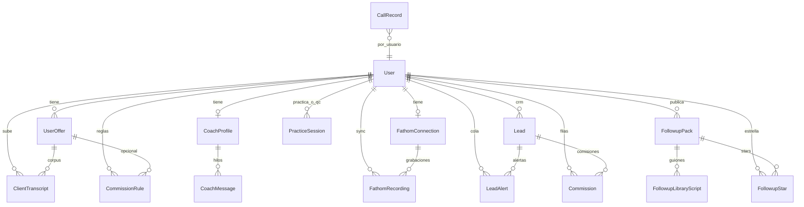
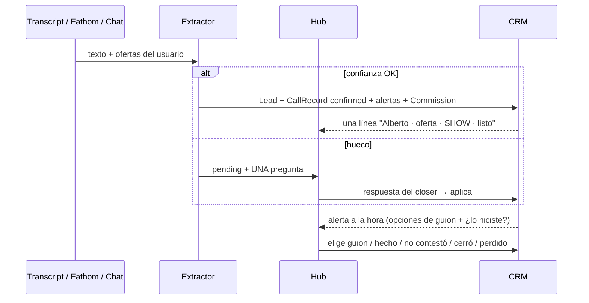

# Closer Trainer — qué hace y cómo se conecta

Mapa del producto **tal como está en el código hoy**. Sirve para ver huecos y qué tocar después. No es un pitch: si algo está a medias, se dice.

Nombre en UI: **Closer Trainer**. Repo: `AK-RP-closer`. App en `web/` (Next.js 15). Agente de voz en `agent/` (LiveKit + Gemini Live).

---

## En una frase

Entrenas cierre high-ticket con un bot que **habla como tus leads reales**. Subes o sincronizas llamadas, el extractor llena el CRM (solo pregunta lo que no pudo resolver), practicas por voz, recibes QC.

El bot **no es el coach**. El bot es el prospecto. El coach es otra capa, después.

Hay que estar logueada (Google o email/contraseña). No hay flujo guest.

---

## Piezas de la app

Navegación: **Inicio · Llamadas · Práctica · Coach · CRM · Ofertas · Biblioteca**.

| Pantalla | Qué hace el usuario | De dónde sale la data |
|----------|---------------------|------------------------|
| **Inicio** `/` | Chat: huecos del extractor, alertas (Hecho / no contestó / cerró…), completar oferta, proyección, “me pagaron la comisión”, “mi WhatsApp es +51…”. Sin sesión: landing. | Workspace + CRM + extractor + `CoachMessage` (`thread: hub`) |
| **Llamadas** `/llamadas` | Fathom, Google Calendar, sync, auditar (QC), corpus. Desde cada fila: **Recrear** o **Lead nuevo**. | `FathomRecording` + `ClientTranscript` + `CallRecord` |
| **Práctica** `/practicar` | Roleplay por voz. **Compose** o **Replay**. | Oferta + playbook + transcript de replay |
| **Coach** `/coach` | Chat + insights + borrar análisis. | `PracticeSession` + `CoachMessage` (`thread: coach`) |
| **CRM** `/crm` | Lectura: cola con opciones de mensaje, métricas, comisiones. Se escribe por chat o botones. Gate `ready_crm`. | `Lead` + `LeadAlert` + `Commission` |
| **Ofertas** `/ofertas` | Nombre/pitch + PDF (precio, pagos, comisión). Gates `ready` y `ready_crm`. Publicar guiones a la biblioteca. | `UserOffer.commercial` + playbook |
| **Biblioteca** `/biblioteca` | Packs de seguimiento tipo repo: publisher, estrellas, puntaje. Publicar / instalar en una oferta. | `FollowupPack` + `FollowupLibraryScript` + `FollowupStar` |

Rutas que solo redirigen: `/setup` → `/ofertas`. `/fathom` y `/reporte` → `/llamadas`.

---

## Cómo se interconecta

```
Oferta completa (commercial) + transcripts / Fathom / Calendar
        │
        ├──────────────────────────────► Playbook ──► Bot (prospecto)
        │
        ▼
   Extractor (prompt generado con las ofertas)
        │
        ├─ auto (confianza ≥ 85) ──► Lead + CallRecord + Alertas + Commission
        └─ hueco ──► Hub pregunta UNA cosa ──► aplica
                              │
                              ▼
                     Cola (guion con originId si viene de biblioteca)
                              │
              Cron diario ──► email al closer (lista + wa.me al lead + link al CRM)
                              │
                              ▼
                     Coach (insights + chat) ◄── QC

Biblioteca (packs públicos)
   publicar / instalar / ★ / puntaje (hechos, cierres, perdidos)
        │
        └──► UserOffer.commercial.scripts.originId
```

Flujo feliz:

1. Guardas **oferta completa** (o el hub pregunta lo que falte) y **llamadas** (Fathom, archivo o Calendar).
2. Gemini **agrega** al **playbook** (tipos, frases, objeciones). No reescribe uno que ya funciona.
3. El extractor aplica al CRM **solo** si hay confianza ≥ 85 y no pide revisión. Si falta un dato, el hub pregunta **ese hueco**.
4. QC de Fathom o **Auditar** en un upload → reporte en Coach. Se puede **borrar** y re-auditar.
5. **Practicas**: compose o replay. Colgada corta: no se evalúa. Llamada de verdad: reporte + “¿practicamos esto otra vez?”.
6. El **coach** manda drills con `?focus=` / `?section=`. Razón de no cierre y etapa perdida alimentan el coach.
7. El **hub** resuelve alertas, agendas y comisiones. Fuera de la app: email diario con `wa.me` al lead + link para marcar el CRM.
8. En **Biblioteca** publicas o instalas packs de seguimiento. El CRM usa esos guiones; el outcome alimenta el puntaje.

---

## Gates

Un solo lugar (`getWorkspace`) verifica ambos:

| Gate | Condición | Si falta |
|------|-----------|----------|
| `ready` (práctica) | Oferta con nombre **y** al menos un transcript usable | No se puede entrar a `/practicar` |
| `ready_crm` | Al menos una oferta con `nombre` + `precio_lista` + `modos_pago` + `regla_comision` | Extractor solo marca SHOW / NO SHOW / REPROGRAMA. CRM y proyección piden completar la oferta. |

---

## Módulos

### 1. Oferta y playbook

**Archivos:** `web/src/app/ofertas/page.tsx`, `web/src/lib/workspace.ts`, `web/src/lib/lead-playbook.ts`, `web/src/lib/offer-commercial.ts`.

Una oferta tiene nombre, descripción, pitch, `includeFathom`, playbook **y** `commercial` (precio, pagos, comisión, **scripts de seguimiento**).

`/api/offer-from-doc` extrae esos campos de un PDF. Lo que falte lo pregunta el hub, uno por uno. No hay formulario de comisión. Si hay `regla_comision`, se persiste también en `CommissionRule`.

El playbook se **agrega** (delta), no se reescribe. Fathom es por usuario; `includeFathom` decide si esas grabaciones entran al corpus de **esa** oferta.

### 2. Llamadas reales

Tres capas:

| Capa | Tabla | Qué guarda |
|------|--------|------------|
| Texto | `ClientTranscript` / `FathomRecording` | Transcript (+ `transcriptJson` en Fathom) |
| Extractor | `CallRecord.filingJson` | JSON del protocolo (claves abajo) + columnas indexadas de montos / `estadoAgenda` |
| Análisis | `PracticeSession` `qc_transcript` | QC. Fathom apunta con `practiceSessionId` |

`fileCallQuietly` → `runExtractor`. Prompt **generado** con las ofertas del usuario (PRODUCTOS, MODO DE PAGO, precios, plazos, moneda). Auto-confirma si no hay revisión humana y los campos CRM tienen confianza ≥ 85. Si falta un dato, `pending` con **una** pregunta.

`estado_agenda`: `AGENDADO` · `SHOW` · `CIERRE VENTA` · `ACUERDO SIN PAGO` · `REPROGRAMA` · `NO SHOW`.

`CIERRE VENTA` exige dinero cobrado **en** la llamada. `ACUERDO SIN PAGO` = acuerdo definitivo, pago fuera → arranca la cadena de cobro (bienvenida + cuota). A los N días (default 3) sin cobro → DECISION (cierre caído).

Fuentes de `CallRecord.source`: `fathom` · `upload` · `qc` · `chat` · `calendar`.

### 3. Práctica de voz

**Web:** `training-setup-form.tsx` → `POST /api/token` → LiveKit.  
**Agente:** `agent/main.py` (nombre `closer-trainer`).

- **Compose** — persona nueva desde el playbook.
- **Replay** — recrear una que no cerró. Fathom: speakers de `transcriptJson`. Uploads: parseo + speakers del extractor si hay.

Al desconectar: si fue prematura **no se evalúa**. Si hubo llamada: reporte + “¿Practicamos esto otra vez?”.

El agente **no habla primero**.

### 4. Coach

Chat (`/api/coach-chat` → `coach-service`), insights (`/api/coach`), análisis borrable (`DELETE /api/coach/[id]`). Hilos en `CoachMessage` (`thread: coach` | `hub`).

### 5. Hub (Inicio)

`/api/hub`. Completa oferta, responde huecos del extractor, ciclo de alertas (elige un guion y dice si lo hiciste), “agendé a Juan el jueves”, proyección, comisión cobrada. Cada alerta trae **opciones** de mensaje según el tipo que salió de la llamada.

### 6. CRM

Cola = `LeadAlert` con **opciones de guion**. El extractor fija el **tipo** según la llamada; el CRM arma hasta 4 mensajes ya rellenados. El closer **elige** uno y **Abrir WhatsApp** lanza `wa.me` con el teléfono del lead y el texto listo (sin Twilio). Si no hay número, WhatsApp abre para elegir el chat. Copiar sigue ahí. `originId` del elegido alimenta el puntaje cuando marca hecho / no contestó / cerró / perdido.

Tras un cierre con saldo, se arma la cadena de cobro: bienvenida (2 h) → validación (24 h) → experiencia (día 8) → pre-cobranza (7 días antes) → día de pago. Si no contestan, el siguiente toque cambia de guion (recordatorio, luego vencido). Al 3er intento el hub pregunta si lo marcas perdido. Si pagan, se cierra el cobro y sale el mensaje de post-cobranza.

Show sin cierre → DECISION / RETOMAR. No show → REAGENDAR. Los creativos (poema, “soñé contigo”, podcasts, Canva) van como scripts de **esa** oferta, no globales.

`cash_collected > 0` crea `Commission` con el % del tramo (regla de la oferta; default 3% hasta 70k, 5% después, base cash, período mensual). Comisión sin cobrar > N días (default 15) → alerta COMISION.

Métricas ahora: vencidos, hoy, agendas, en juego, cash pendiente, comisión pendiente. Rendimiento: show rate, close rate sobre shows, close rate calificado, ticket, ventas, cash. Desglose por oferta, razón de no cierre, etapa perdida. Serie últimos 6 meses.

Proyección: meta USD + fecha → agendas/día y palancas en este orden: (1) cobrar pendiente, (2) cerrar seguimientos con más dinero en juego, (3) subir close rate → coach, (4) agendar más.

### 7. Agendas y avisos al closer

- Chat: “agendé a X el jueves 3 p.m.” → `CallRecord` `AGENDADO`.
- Google Calendar (`/llamadas`): eventos con Zoom/Meet → `AGENDADO`. Redirect extra: `/api/calendar/callback`.
- A las 24 h sin transcript → alerta `AGENDA_CHECK`.

El closer **no recibe un WhatsApp empujado**. `wa.me` solo abre WhatsApp cuando haces click; no te escribe solo (eso sería Twilio/API).

Cómo se entera y cómo actualiza el CRM:

- **En la app (Inicio):** cada alerta pregunta, eliges guion, **Abrir WhatsApp** (al lead) y marcas hecho / no contestó / cerró / perdido. Eso escribe el CRM.
- **Si no entraste:** cron diario 13:00 UTC manda **email** con la lista. Cada ítem trae `wa.me` al lead y un link a Inicio para marcar. `CRON_SECRET` + Resend. En Hobby no hay cron cada hora.
- Twilio queda en el repo apagado. No hace falta para notificar ni para mandar al lead.

### 8. Biblioteca de seguimientos

Pantalla `/biblioteca`. Packs públicos, analogía de repos: quien publica queda tagged (`@publisher`), otros estrellan, e instalar copia los guiones a `UserOffer.commercial.scripts` con `originId` apuntando al script de la biblioteca.

Se publica desde la oferta (todos sus `commercial.scripts`) o con un guion suelto en la misma pantalla. No hay pack global de creativos PAE: cada closer sube los suyos.

Puntaje 0–100 por pack (y por guion): **70% tasa de cierre** (`cierres / (cierres + perdidos)`) + **30% tasa de envío** (`hechos / uses`). `uses` y `hechos` suben cuando el closer marca un outcome con ese guion elegido (hecho / no contestó cuentan envío; cerró también). Los genéricos de `followup-scripts.ts` no puntúan: no tienen `originId`.

---

## Modelo de datos

Prisma: `web/prisma/schema.prisma`. En runtime, columnas nuevas se crean con `ensureCrmTables` (ALTER) si el `db push` no corrió.

### Relaciones (UML)



`CallRecord` no tiene FK a `Lead`. El vínculo es por nombre (match) y `LeadAlert.callRecordId` (texto). `FathomRecording.practiceSessionId` apunta a un QC o `"skipped"`. `LeadAlert.libraryScriptId` apunta a `FollowupLibraryScript.id` (texto, sin FK).

### Tablas y campos que importan

**User**

| Campo | Qué es |
|-------|--------|
| `crmPrefs` JSON | `followupGraceDays` (3), `commissionUnpaidDays` (15), `acuerdoSinPagoDays` (3), `timezone`, `digestHour` (8), `whatsappE164` |
| `calendarRefreshEnc` | Refresh token de Google Calendar (cifrado) |
| `calendarSyncedAt` | Último sync |

**UserOffer**

| Campo | Qué es |
|-------|--------|
| `productName`, `productDescription`, `pitchSummary` | Texto de la oferta |
| `playbook` JSON | ICP, frases, objeciones, `leadTypes`, personas |
| `commercial` JSON | Ver bloque abajo |
| `includeFathom` | Si el corpus de esta oferta usa Fathom |

**CallRecord** (una fila por llamada / evento)

| Campo | Qué es |
|-------|--------|
| `source` + `sourceId` | Único por usuario. `fathom` / `upload` / `calendar` / `chat` / `qc` |
| `filingStatus` | `pending` · `confirmed` · `skipped` |
| `filingJson` | `ExtractorJson` completo |
| `estadoAgenda` | Indexado. Valores del catálogo |
| `ventaTotal`, `cashCollected`, `saldoPendiente`, `modoPago` | Copia indexada del extractor (null si no hay `ready_crm`) |
| `recordedAt` | Fecha de la llamada o de la agenda futura |

**Lead**

Además de ficha clásica (`status`, `nextStep`, montos como texto): `telefono`, `email`, `canalContacto`, `calificado`, `razonNoCierre`, `etapaPerdida`.

**LeadAlert**

| Campo | Qué es |
|-------|--------|
| `type` | `ONBOARDING` · `VALIDACION` · `EXPERIENCIA` · `PRE_COBRANZA` · `PAGO PENDIENTE` · `COBRO_VENCIDO` · `POST_COBRANZA` · `SEGUNDA REUNION` · `DECISION` · `RETOMAR` · `REAGENDAR` · `COMISION` · `AGENDA_CHECK` · `OTRO` |
| `dueAt` / `resolvedAt` | Abierta si `resolvedAt` es null |
| `enJuego` | USD |
| `canal` | WHATSAPP / LLAMADA / EMAIL |
| `mensajeSugerido` | Guion elegido (o el primero si aún no eligió). Variables ya sustituidas |
| `contexto` | Cómo enviarlo + notas de la llamada |
| `resultado` | hecho / no_contesto / reprogramado / cerro / perdido |
| `intentos` | No contestó; cambia de guion. Al 3er → “¿lo marco perdido?” |
| `callRecordId` | Texto, sin FK |
| `libraryScriptId` | Script de biblioteca elegido (vacío si es de la oferta o genérico) |

**CommissionRule** (espejo de `commercial.commission`, por usuario y oferta)

`pctBase`, `umbralAcumuladoUsd`, `pctSobreUmbral`, `base` (`cash_collected` \| `venta_total`), `periodoAcumulacion` (`mensual` \| `anual` \| `total`).

**Commission** (una fila por cobro con `cash > 0`)

`venta`, `cash`, `pctAplicado`, `generada`, `cobrada`, `fechaCobro`, `estado` (`PENDIENTE` \| `COBRADA` \| `PARCIAL`).

**FollowupPack** — pack público (`visibility: public`). `title`, `description`, `tags` (csv), publisher = `userId`.

**FollowupLibraryScript** — un guion del pack. `key`, `type`, `intentosMin`, `canal`, `recomendacion`, `guion`, `asset`, contadores `uses` / `hechos` / `cierres` / `perdidos`.

**FollowupStar** — único por (`userId`, `packId`).

**PracticeSession** — prácticas de voz y QC (`callSection`: `full|discovery|pitch|close|pitch_close` o `qc_transcript`). Los chats **no** viven aquí.

**CoachMessage** — `thread: coach` o `hub`.

### JSON: `UserOffer.commercial`

```json
{
  "aliases": ["CM"],
  "listPrice": 12000,
  "currency": "USD",
  "fxRate": 3.5,
  "altPrices": [{ "label": "contado 7 días", "amount": 10000 }],
  "paymentModes": [{ "name": "Contado 7 días", "details": "" }],
  "deadlines": [{ "name": "Contado", "days": 7, "appliesTo": "contado" }],
  "bonuses": [{ "name": "Contratación", "condition": "si paga contado" }],
  "paymentDetails": "BCP …",
  "duration": "6 meses",
  "commission": {
    "pctBase": 0.03,
    "umbralAcumuladoUsd": 70000,
    "pctSobreUmbral": 0.05,
    "base": "cash_collected",
    "periodoAcumulacion": "mensual"
  },
  "scripts": [
    {
      "key": "poema",
      "type": "RETOMAR",
      "intentosMin": 1,
      "canal": "WHATSAPP",
      "recomendacion": "Lead emocional que no contesta. Máx. 200 palabras.",
      "guion": "Hola [Nombre]… [PROGRAMA] … ¿Qué falta para que tomes acción?",
      "asset": "https://…",
      "originId": "id-del-script-en-biblioteca"
    }
  ]
}
```

Nada de esto está hardcodeado a PAE. El extractor recibe la lista de ofertas del usuario. Los guiones de seguimiento viven en `commercial.scripts` (o en la secuencia genérica de `followup-scripts.ts`). `originId` aparece cuando el script se instaló o se publicó desde esa oferta.

### JSON: `CallRecord.filingJson` (extractor)

Claves del protocolo + extras Closer Trainer:

```
cliente_real, estado_agenda, producto, venta_total, cash_collected,
saldo_pendiente, modo_pago, requiere_seguimiento, tipo_seguimiento,
proximo_seguimiento, acuerdo_seguimiento, notas_crm,
evidencia{}, confianza{},
requiere_revision_humana, motivo_revision,
calificado, razon_no_cierre, etapa_perdida,
canal_contacto, telefono, email
```

Regla: confianza &lt; 85 → ese campo va `null`. Auto-aplicar solo si no hay revisión humana y no queda hueco CRM.

### Catálogos (no se copian del Excel)

| Uso | Valores |
|-----|---------|
| `estado_agenda` | AGENDADO, SHOW, CIERRE VENTA, ACUERDO SIN PAGO, REPROGRAMA, NO SHOW |
| `tipo_seguimiento` / alerta | ONBOARDING, VALIDACION, EXPERIENCIA, PRE_COBRANZA, PAGO PENDIENTE, COBRO_VENCIDO, POST_COBRANZA, SEGUNDA REUNION, DECISION, RETOMAR, REAGENDAR, COMISION, AGENDA_CHECK, OTRO |
| `razon_no_cierre` | Precio / No tiene dinero, No era el momento, Necesita consultarlo, No confía, Ya compró con otra, No show, Otro |
| `etapa_perdida` | Descubrimiento, Presentación, Objeciones, Cierre, Reserva |
| `canal_contacto` | ZOOM, MEET, WHATSAPP, LLAMADA, PRESENCIAL |

### De llamada a CRM



El hub **pregunta y espera**. Si no entras, email diario: WhatsApp al lead (`wa.me`) y link para actualizar el CRM. Nada se empuja por WhatsApp al closer.

Alertas al aplicar el JSON:

| Situación | Alerta |
|-----------|--------|
| CIERRE VENTA o ACUERDO SIN PAGO (con `ready_crm`) | Cadena: ONBOARDING (+2 h) → VALIDACION (+24 h) → EXPERIENCIA (+8 d) → PRE_COBRANZA (7 d antes del vencimiento) → PAGO PENDIENTE (día de cuota) |
| `requiere_seguimiento` + fecha (sin cierre) | tipo extraído en esa fecha (DECISION / RETOMAR / …) |
| `requiere_seguimiento` sin fecha | + `followupGraceDays` (3) |
| `saldo_pendiente > 0` sin cierre | PAGO PENDIENTE en el plazo de la oferta |
| SHOW sin cierre | DECISION o RETOMAR |
| NO SHOW | REAGENDAR +1 día |
| REPROGRAMA | SEGUNDA REUNION en la nueva fecha |
| No contestó (cobro) | Mismo hilo, otro guion (recordatorio → COBRO_VENCIDO). 3er intento pregunta si lo marcas perdido |
| Pagó (Hecho en PAGO PENDIENTE) | Cierra cobros abiertos + POST_COBRANZA |
| `requiere_seguimiento = false` | cierra alertas abiertas del lead |

---

## APIs

| Ruta | Rol |
|------|-----|
| `/api/workspace` `offer` `transcripts` | Ofertas (incluye `commercial`) y corpus |
| `/api/offer-from-doc` | Extraer oferta completa de PDF/TXT |
| `/api/token` | JWT LiveKit |
| `/api/evaluate` | Score de práctica |
| `/api/practice-calls` | Replay |
| `/api/llamadas` | Biblioteca + clasificar siguiente |
| `/api/fathom/*` | Fathom |
| `/api/qc-report` | QC upload |
| `/api/coach` `/api/coach-chat` `/api/coach/[id]` | Coach |
| `/api/hub` | Hub + huecos + alertas (pick-script) + proyección + agendas |
| `/api/crm` | Tablero + PATCH outcome / agenda / pick-script |
| `/api/biblioteca` | Packs públicos: listar, publicar, estrellar, instalar en oferta |
| `/api/calendar` `/api/calendar/connect` | Google Calendar → AGENDADO |
| `/api/cron/alert-digest` | Cron diario: jobs + email al closer |
| `/api/auth/*` `/api/config` `/api/health/db` | Auth y flags |

Gemini en servidor para playbook, QC, eval, extractor y chats. El agente de voz usa Gemini Live.

---

## Qué sigue abierto

- CRM sigue **sin ficha editable**. A propósito.
- La biblioteca arranca vacía: no hay packs semilla. El puntaje solo se mueve cuando alguien instala un pack y marca outcomes reales.
- Avisos al closer: **Inicio** (en vivo) + **email diario**. El CRM se actualiza en la app (botones / chat), no respondiendo un WhatsApp.
- Al lead: botón **Abrir WhatsApp** (`wa.me`). Twilio no hace falta.
- `wa.me` no puede notificarte solo: no hay push sin API (Twilio).
- Calendar pide Calendar API encendida y redirect `/api/calendar/callback` en el mismo OAuth client de Google.

Productos, % y plazos no están hardcodeados: salen de `UserOffer.commercial`. El protocolo PAE es la plantilla; el prompt se rellena con las ofertas del usuario.
